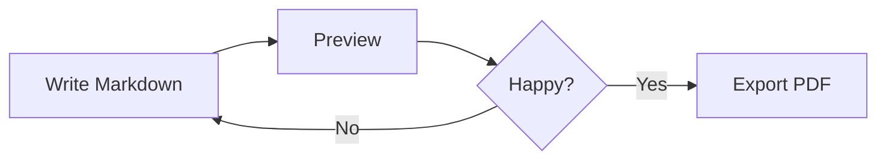

# Welcome to Markdown → PDF

Write your document here. The preview updates as you type.

## Mermaid Diagrams



## Math Formulas

Inline: $E = mc^2$

Block:

$$\int_{-\infty}^{\infty} e^{-x^2}\, dx = \sqrt{\pi}$$

## Code

```typescript
function greet(name: string): string {
  return `Hello, ${name}!`;
}
```

## Table

| Feature       | Supported |
|---------------|-----------|
| Mermaid       | ✓         |
| Math (KaTeX)  | ✓         |
| Syntax HL     | ✓         |
| Dark mode     | ✓         |

> **Tip:** Use **Alt+1/2/3** to switch view modes, and **Ctrl+P** to export.
